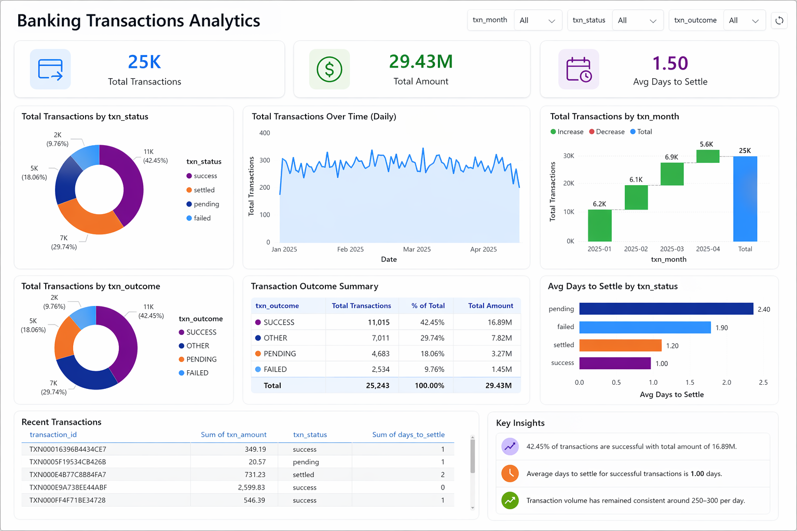
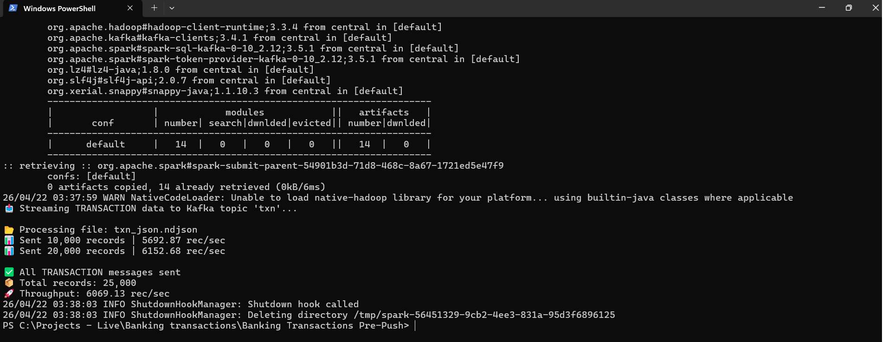
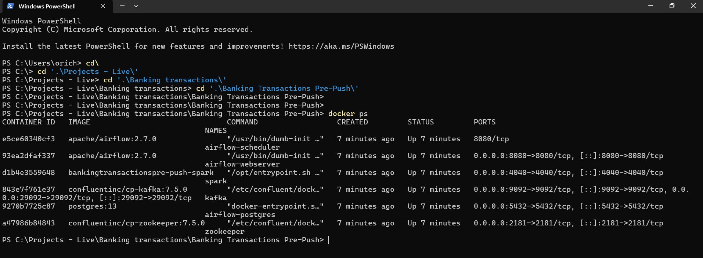
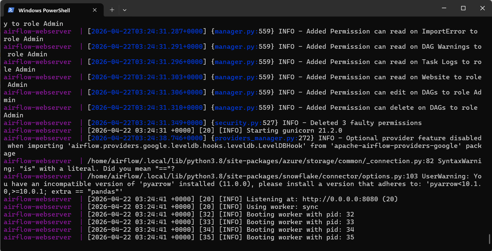
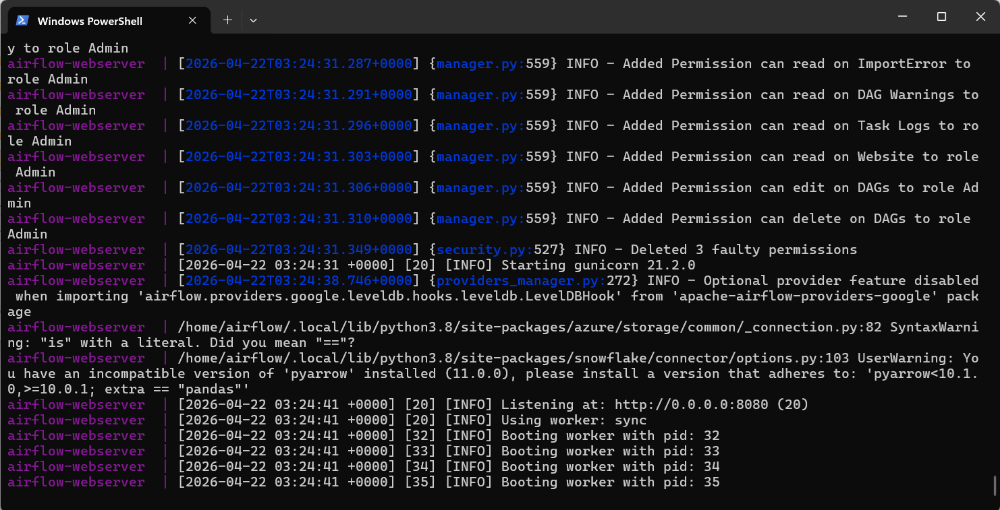
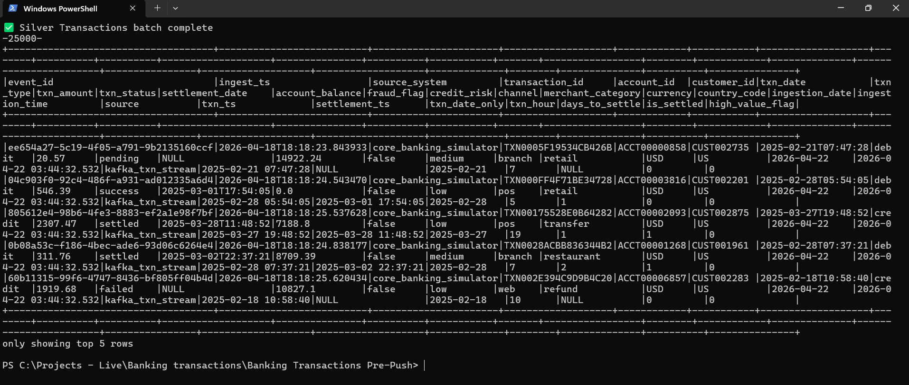
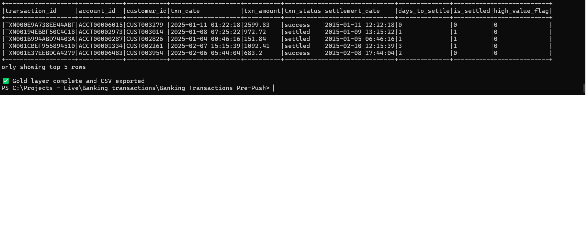

# 📦 Real-Time Banking Transactions Pipeline | Kafka + PySpark + Airflow + Delta Lake

## 📌 Overview

Kafka-based streaming pipeline using PySpark Structured Streaming, orchestrated with Airflow and built on a medallion architecture, delivering analytics-ready Gold tables and Power BI dashboards.

## 🚀 Architecture Overview

NDJSON Transaction Generator  
↓  
Kafka Producer  
↓  
Kafka Topic (`txn`)  
↓  
PySpark Structured Streaming Consumer  
↓  
Bronze Delta (Raw Transactions)  
↓  
Airflow DAG (Silver → Gold Orchestration)  
↓  
Silver Delta (Cleaned + Enriched Transactions)  
↓  
Gold Analytics Tables + Dimensions  
↓  
CSV Export for Power BI  
↓  
Power BI Dashboard

## 🚀 Architecture

<details open>
<summary><b>View Architecture</b></summary>

```text
Transaction Source
└── Synthetic Transaction Generator
    └── NDJSON File Creation (/data/raw/raw_transactions.ndjson)
        ├── Transaction Identifiers
        │   ├── event_id
        │   ├── transaction_id
        │   ├── account_id
        │   └── customer_id
        │
        ├── Transaction Attributes
        │   ├── txn_type
        │   ├── txn_amount
        │   ├── txn_status
        │   ├── account_balance
        │   └── credit_risk
        │
        └── Context Fields
            ├── txn_date
            ├── settlement_date
            ├── channel
            ├── merchant_category
            ├── currency
            └── country_code

Streaming Ingestion Layer
└── Kafka Producer
    └── Kafka Topic (txn)
        └── Keyed by account_id for partitioning

Processing Layer
└── PySpark Structured Streaming Consumer
    ├── Reads transaction events from Kafka
    ├── Parses JSON payload into structured schema
    ├── Appends ingestion timestamp
    └── Writes raw stream to Bronze Delta

Bronze Layer
└── /data/bronze/transactions
    ├── Raw transaction events
    ├── Streaming append-only storage
    ├── Original event payload preserved
    └── Ingestion-ready Delta Lake table

Orchestration Layer
└── Apache Airflow DAG
    ├── Scheduled every 3 minutes
    ├── Triggers Silver transformation job
    ├── Triggers Gold aggregation job
    ├── Manages Bronze → Silver → Gold dependency flow
    └── Monitors recurring batch processing

Silver Layer
└── /data/silver/transactions
    ├── Cleaned and standardized transactions
    ├── Data quality filtering
    │   ├── non-null transaction_id
    │   ├── non-null account_id
    │   ├── non-null customer_id
    │   ├── positive txn_amount
    │   └── valid txn_date
    │
    ├── Derived business columns
    │   ├── txn_ts
    │   ├── settlement_ts
    │   ├── txn_date_only
    │   ├── txn_hour
    │   ├── days_to_settle
    │   ├── is_settled
    │   └── high_value_flag
    │
    ├── Standardized fields
    │   ├── txn_type
    │   ├── txn_status
    │   ├── channel
    │   ├── merchant_category
    │   ├── currency
    │   └── country_code
    │
    └── Deduplicated records
        └── latest record per transaction_id

Gold Layer
└── Business Analytics Tables
    ├── gold_transaction_lifecycle
    │   └── transaction-level lifecycle and settlement metrics
    │
    ├── gold_fraud_detection
    │   └── fraud indicators using amount, transaction hour, and country rules
    │
    ├── gold_credit_risk
    │   └── account-level spend, volume, and derived risk score
    │
    ├── gold_transaction_summary
    │   └── daily aggregated transaction KPIs
    │
    └── Dimension Tables
        ├── dim_date
        ├── dim_account
        ├── dim_customer
        ├── dim_transaction_type
        ├── dim_channel
        ├── dim_country
        └── dim_merchant

Consumption Layer
└── BI / Reporting Output
    ├── Delta Gold tables for analytics
    ├── CSV export for Power BI (/data/raw/)
    │   ├── gold_transaction_lifecycle
    │   ├── gold_fraud_detection
    │   ├── gold_credit_risk
    │   ├── gold_transaction_summary
    │   └── dimension tables
    │
    └── Power BI Dashboard
        ├── KPI Overview
        │   ├── total transactions
        │   ├── total transaction amount
        │   └── average transaction amount
        │
        ├── Status Monitoring
        │   ├── settled vs pending vs failed
        │   └── settlement performance
        │
        ├── Fraud / Risk Insights
        │   ├── fraud-flagged transactions
        │   ├── high-value transaction volume
        │   └── account risk score trends
        │
        └── Trend Analysis
            ├── daily transaction volume
            ├── daily transaction amount
            └── operational transaction patterns by channel / merchant
```

</details>

---

## ▶️ How to Run

### 1. Start services

```bash
docker compose up --build
```

### 2. Start Kafka producer

```bash
python app/Txn_Producer_ndjson.py
```

### 3. Start Spark streaming job

```bash
spark-submit app/Txn_Consumer_writeStream_bronze.py
```

### 4. Open Airflow UI

```text
http://localhost:8080
```

---

## ⚡ Streaming Features

- Exactly-once processing
- Checkpointing for fault tolerance
- Scalable real-time ingestion via Kafka

## ⚙️ Tech Stack

- Python
- NDJSON (Newline Delimited JSON)
- Apache Kafka
- PySpark
- Apache Airflow
- Delta Lake
- Docker
- Medallion Architecture (Bronze → Silver → Gold)
- Power BI dashboard for analytics and visualization

### 🚀 Data Processing

- PySpark / Apache Spark 3.5.x
- Structured Streaming
- Batch processing with Delta Lake pipelines

### 🧊 Storage

- Delta Lake tables for Bronze, Silver, and Gold layers
- Parquet-based columnar storage for high-performance queries
- Scalable structured data modeling for analytics

### 🐳 Infrastructure

- Docker
- Docker Compose
- Kafka
- Zookeeper
- Airflow webserver and scheduler
- Spark processing container
- Postgres metadata database

---

## 🔄 Data Flow

```text
Kafka Producer → Kafka Topic → PySpark Consumer → Bronze Delta
→ Airflow DAG → Silver Transformations → Gold Aggregations
→ CSV Export → Power BI Dashboard
```

### 🔄 Processing Logic

- Event parsing and transformation
- Structured column mapping
- Window functions for sequencing
- Silver layer cleaning and enrichment
- Gold layer fact and dimension modeling

### 🧪 Data Quality

- Non-null validation checks
- Format validation
- Duplicate detection
- Transaction amount validation
- Output-ready validation results

### 📊 Analytics

- Developed Gold-layer aggregations using Spark SQL
- Created BI-ready fact and dimension datasets
- Exported CSV files for dashboard reporting

---

## 📸 Pipeline in Action

### 📊 Power BI Dashboard (Transaction Analytics)



- Interactive dashboard built on Gold layer analytics tables
- Provides insights into transaction performance, volume, and risk
### 📡 Kafka Producer (Streaming Ingestion)



- PySpark-based producer streaming transaction data to Kafka topic `txn`
- Reads NDJSON transaction dataset and publishes events in real time

### 🐳 Docker Containers Status (Runtime Verification)



- Live snapshot of running containers using `docker ps`
- Confirms all core services are up and healthy

### 🔄 Apache Airflow Start-Up



- Airflow webserver running in Docker
- UI available at `http://localhost:8080`
- Confirms orchestration layer is active

### 🔄 Apache Airflow DAG (Pipeline Orchestration)



- Airflow DAG orchestrating the Silver → Gold transaction pipeline
- Automates transformation workflow on a scheduled basis

### 🥈 Silver Layer (Cleaned & Enriched Transactions)



- Cleaned and transformed dataset generated from Bronze layer
- Represents structured, validated, and enriched transaction data

### 🥇 Gold Layer Output (Business-Ready Data)



- Final curated dataset generated from Silver transformations
- Represents a business-ready transaction analytics table


---

## 💼 Business Value

- Enables real-time transaction tracking
- Improves processing efficiency
- Identifies anomalies and risk patterns
- Supports analytics workflows and executive dashboards

## 👨‍💻 Author

Odis Richardson
